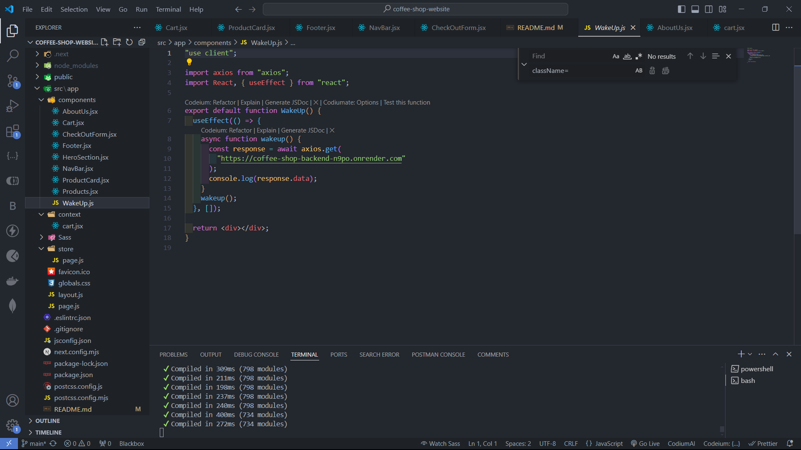
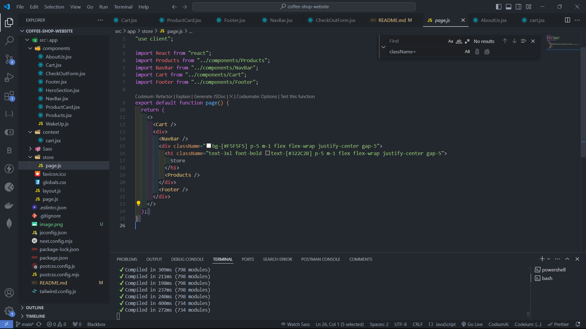
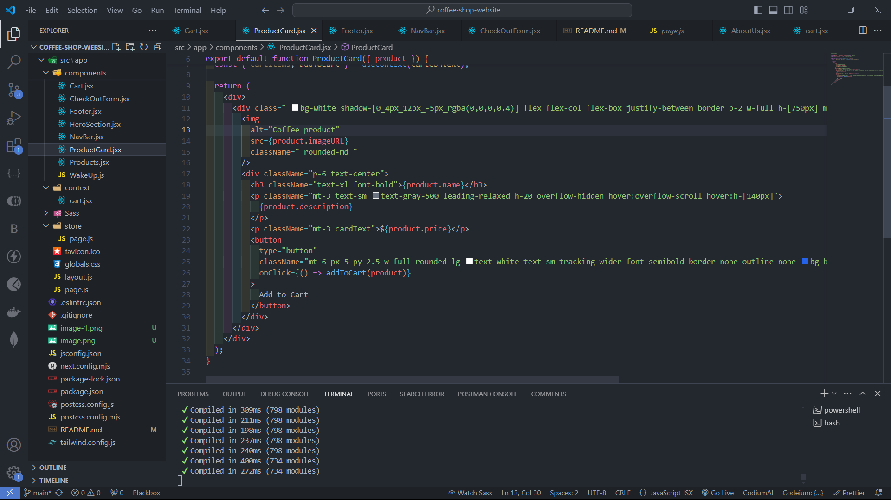
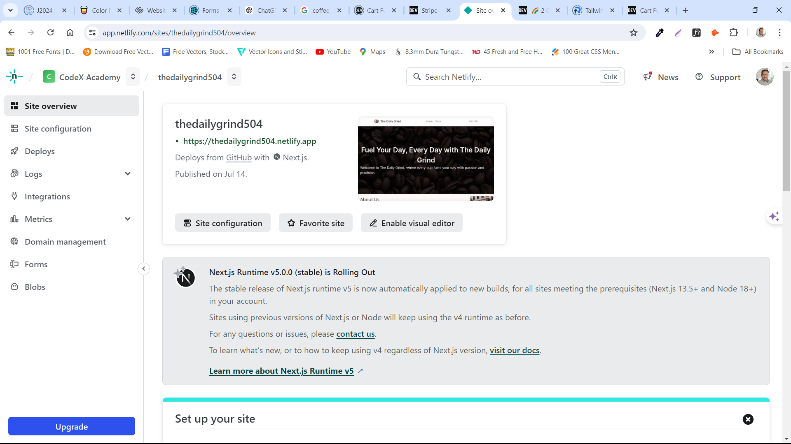

# Coffee Shop Website - Capstone 4

## Overview

This is a website for a coffee shop. It is a capstone project for the Full Stack Web. I built the backend for the coffee and added projects to display it on my frontend website.

## Features

- [Coffee Shop](https://coffeeshop-nextjs-ten.vercel.app/) This is the API that is set up on Render.

- [Products](https://coffeeshop-nextjs-ten.vercel.app/products) This is a API that shows the products.

- [Wake Up Coffee](https://wakeup-coffee.vercel.app/) This wakes up the backend on Render.

## Build the Frontend

### Create Next.js App

To get started, run the following command:

```bash
npm install -g create-next-app
```

Then run the following command:

```bash
create-next-app coffee-shop-website
```

### Waking up the Backend

Since I am using Render as my backend to deploy my api it goes to sleep.



### Building the cart.

I used an article that help me set up the cart and the components.

https://dev.to/anne46/cart-functionality-in-react-with-context-api-2k2f

### Adding the cart to the frontend.



I created a store page and I added my cart to the store.

### Product Cards.

I created a Card to display from the API and shows the Image, name, description, and price.



### Adding the Product Card to the Store page.

```jsx
  const [products, setProducts] = useState([]);
  const [loading, setLoading] = useState(true);
  const [showModal, setShowModal] = useState(false);

  const toggleModal = () => {
    setShowModal(!showModal);
  };

  useEffect(() => {
    async function fetchProducts() {
      const response = await axios.get(
        "https://coffee-shop-backend-n9po.onrender.com/products"
      );
      setProducts(response.data);
      setLoading(false);
      console.log(response.data);
    }
    fetchProducts();
  }, []);

  if (loading) {
    return <div className="loader mx-auto"></div>;
  }

  return (
    <div>
      <section className=" p-5 m-1 flex flex-wrap justify-center gap-5">
        {products.map((product) => (
          <ProductCard key={product._id} product={product} />
        ))}
      </section>
    </div>
  );
}

```

## Deploying

Netlify is the site that I used to deploy my site.



https://thedailygrind504.netlify.app/

## Conclusion

This project is a capstone project for the Full Stack Web. I built the backend for the
coffee and added projects to display it on my frontend website. I used an article that
help me set up the cart and the components.

https://dev.to/anne46/cart-functionality-in-react-with-context-api-2k2f

I created a store page and I added my cart to the store. I created a Card to display
from the API and shows the Image, name, description, and price.

This is a [Next.js](https://nextjs.org/) project bootstrapped with [`create-next-app`](https://github.com/vercel/next.js/tree/canary/packages/create-next-app).

## Getting Started

First, run the development server:

```bash
npm run dev
# or
yarn dev
# or
pnpm dev
# or
bun dev
```

Open [http://localhost:3000](http://localhost:3000) with your browser to see the result.

You can start editing the page by modifying `app/page.js`. The page auto-updates as you edit the file.

This project uses [`next/font`](https://nextjs.org/docs/basic-features/font-optimization) to automatically optimize and load Inter, a custom Google Font.

## Learn More

To learn more about Next.js, take a look at the following resources:

- [Next.js Documentation](https://nextjs.org/docs) - learn about Next.js features and API.
- [Learn Next.js](https://nextjs.org/learn) - an interactive Next.js tutorial.

You can check out [the Next.js GitHub repository](https://github.com/vercel/next.js/) - your feedback and contributions are welcome!

## Deploy on Vercel

The easiest way to deploy your Next.js app is to use the [Vercel Platform](https://vercel.com/new?utm_medium=default-template&filter=next.js&utm_source=create-next-app&utm_campaign=create-next-app-readme) from the creators of Next.js.

Check out our [Next.js deployment documentation](https://nextjs.org/docs/deployment) for more details.
